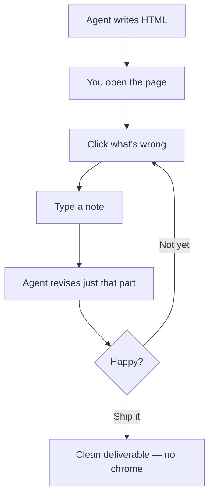

# DOMicile

**Open the page. Click what's wrong. The agent fixes it. Repeat until you ship.**

<p align="left">
  <a href="https://stoopery.app"></a>
</p>

[](https://www.npmjs.com/package/@domi/react)
[](https://crates.io/crates/domi-egui)
[](./LICENSE)
[](https://agentskills.io)


---

## The problem

AI writes you 800 lines of HTML. You open it. Something's off — the sidebar is too wide, the button is the wrong color. You paste a screenshot back into the chat. It rewrites 800 lines. You open it again. Different thing is wrong.

## DOMicile's answer

The document *is* the conversation. Open the page. Click the thing that's wrong. Type six words. The agent fixes just that part. Repeat until it's right, then hand it off — clean HTML, no chrome, ready to ship.

---

## Who is this for?

**You're an AI agent.** Load `domicile/SKILL.md`. You now know the three output modes and the 15 primitives. Go build.

**You're a developer.** `npm install @domi/react`, copy the CSS, start composing. Same primitives, React / Astro / Rust — pick your stack.

**You're a curious human.** Open `templates/dashboard/index.html` in a browser. No install, no build step. Just a page you can click around.

---

## See it in 60 seconds

```bash
git clone https://github.com/zaco-tm/DOMicile.git
cd DOMicile
npm install
npm run smoke
```

Then open <http://127.0.0.1:8123/> in your browser. You'll see a working doc with a feedback rail on the right. Click any element with a dashed outline — its border turns terracotta — type a note in the rail, hit submit. Refresh the page. Your note is still there, anchored to that element.

That's the whole loop. When you're ready to ship, the agent produces a stripped-down HTML using the same primitives — no rail, no chrome.



---

## Why HTML, not Markdown

Here's the thing about markdown specs and screenshots: they go stale the second you open them. An interactive doc gets annotated in place, with comments anchored to the exact element you meant — not to a paragraph that might or might not still be there next revision.

DOMicile is built around that loop:

- You say *"let's build a settings page"*.
- The agent writes a real HTML page in your browser, with clickable sections and a feedback rail.
- You click what looks off, leave a note on that exact element, ask the agent to *"iterate"*.
- The agent revises. The notes stay attached to the elements they refer to.

When you're done, the agent hands you a clean deliverable: same design system, no rail, ready to ship.

---

## Install

Three options depending on what you're after. Full details in [`INSTALL.md`](INSTALL.md).

### For AI agents

DOMicile ships as an [Agent Skills](https://agentskills.io)-compatible `SKILL.md`. Install with one command per agent:

| Agent | Install |
|---|---|
| Universal installer ([openskills](https://www.npmjs.com/package/openskills)) | `npx openskills install zaco-tm/DOMicile` (add `--global` for `~/.claude/skills/`, `--universal` for `.agent/skills/`) |
| Universal (`~/.agents/skills/`) | `mkdir -p ~/.agents/skills/domicile && cp domicile/SKILL.md ~/.agents/skills/domicile/SKILL.md` |
| OpenCode | `mkdir -p ~/.config/opencode/skills/domicile && cp domicile/SKILL.md ~/.config/opencode/skills/domicile/SKILL.md` |
| Claude Code | `mkdir -p ~/.claude/skills/domicile && cp domicile/SKILL.md ~/.claude/skills/domicile/SKILL.md` |
| Kilo Code | `mkdir -p .roo/skills/domicile && cp domicile/SKILL.md .roo/skills/domicile/SKILL.md` |
| PI | `mkdir -p ~/.pi/skills/domicile && cp domicile/SKILL.md ~/.pi/skills/domicile/SKILL.md` |
| Any other Agent Skills client (Crush, Dirac, …) | `mkdir -p <config-dir>/skills/domicile && cp domicile/SKILL.md <config-dir>/skills/domicile/SKILL.md` |

See [`INSTALL.md`](INSTALL.md) for prompt-injection fallback if your agent has no skills discovery. Don't worry — it's just one `mkdir` and one `cp`, even if it looks intimidating at first.

### For developers using the wrappers

```bash
npm install @domi/react react react-dom     # React
npm install @domi/astro astro                # Astro
```

Copy `components/domi.css` into your project. For Rust:

```toml
[dependencies]
domi-egui = "0.1"
```

### For humans just looking

Open `templates/dashboard/index.html` in a browser. No install needed — that's a single static file with the design system rendered.

---

## What's in the box

### The skill (load `domicile/SKILL.md`)

DOMicile is also an AI-agent skill. Agents that load `domicile/SKILL.md` learn three output modes:

| Mode | Trigger | Output |
|---|---|---|
| **Working doc — create** | "let's build X" | HTML in `.domi/output/`, feedback rail on, empty thread |
| **Working doc — audit** | "review this," "iterate" | Same chrome, existing thread loaded |
| **Deliverable** | "ship it," "give me the final" | Clean HTML, no rail, no chrome |

One section at a time. No more "AI wrote me 800 lines and I had to reread it all."

### The design system

- **15 HTML primitives** — buttons, cards, forms, tables, navs, modals, alerts, badges, tabs, toasts, tooltips, inputs, selects, checkboxes, radios. Each has a `domi-*` class and reads tokens from a single CSS variables block.
- **5 archetype templates** — `dashboard`, `webapp-shell`, `mobile-app-shell`, `admin-tool`, `pos-kiosk`. Clone one, fill it in.
- **Neo theme (default)** — plum-to-peach gradient, frosted-glass surfaces, Helvetica Neue Black display + JetBrains Mono body. Drop in your own theme by replacing `tokens/tokens.json`.
- **Same primitives, three languages** — React (`@domi/react`), Astro (`@domi/astro`), and native Rust (`domi-egui`, WASM-capable). Because why not. Token parity is enforced by a SHA-256 test.

### The server (optional)

`domi-server` (Rust + axum) lets the working doc persist comments to disk and push live updates over WebSocket. Standalone mode (no server) uses `localStorage` and works entirely from `file://`. Use the server when you want comments to survive across machines or collaborators.

---

## Good news: you don't need taste. You need eyes

You don't need to read the design system to use DOMicile. First make sure your agent has the skill installed (see [Install](#install) above) — that loads `domicile/SKILL.md` with the trigger phrases, output modes, and primitives the agent needs. Then tell your agent:

- *"Make me a pricing page in the DOMicile style."*
- *"I want a settings screen. Use the dashboard layout."*
- *"Build me a sign-up flow, mobile-first."*

The agent handles primitives, tokens, and the working-doc chrome. You focus on what the page should *do* and what looks right.

---

## See it in action


GIF/MP4 walkthroughs of the loop in action are coming soon — this section will host them once they're cut.

---

## Repo layout

```text
domicile/SKILL.md           ← load this in agents
AGENTS.md                   ← repo conventions for agents
README.md                   ← you are here
tokens/                     ← design tokens (single source of truth)
components/
  primitives/<name>/        ← 15 HTML primitives
  domi.css                  ← primitive styles
templates/<archetype>/      ← dashboard, webapp-shell, mobile-app-shell, admin-tool, pos-kiosk, working-doc
scripts/runtime/            ← domi.js, domi-audit.js, domi-server.js, domi-wire.js
crates/domi-server/         ← Rust HTTP binary + agent CLI
crates/domi-egui/          ← Rust native widgets + composites
packages/react/             ← @domi/react (15 components)
packages/astro/             ← @domi/astro (15 wrappers)
tools/                      ← smoke, skill-loop, e2e tests
docs/
  USAGE.md, DESIGN.md, STANDARDS.md    ← library reference
  AUDIT.md, EXTENDING.md, LAYOUTS.md   ← workflow + extension guides
  WIRE-PROTOCOL.md, RUST.md            ← technical specs
```

---

## Status

The skill loop works end-to-end (local smoke and event-backed server modes both green). The library is stable and the skill is playable.

**Tests:** 250 JS passed (2 skipped) / 84 Rust passed (13 ignored).

---

## License

MIT — do whatever you want with it.

Built with love (and a lot of `npm test`) by the team at [stoopery](https://stoopery.app).
